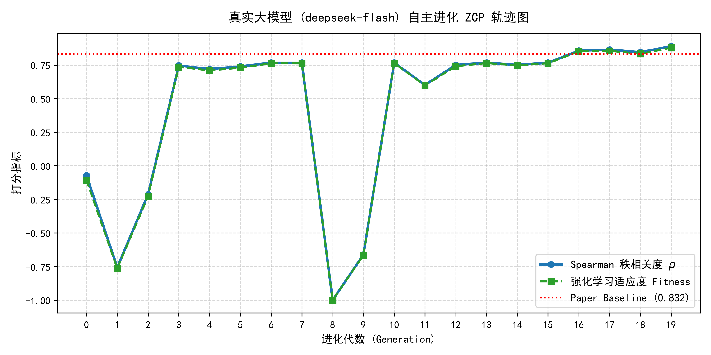
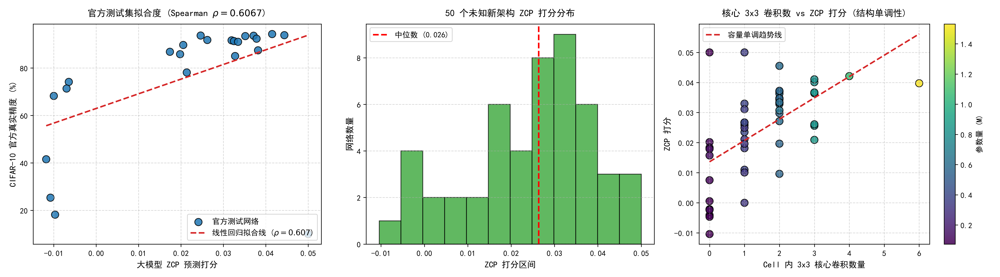

# 🚀 APD: LLM-Driven Automatic Zero-Cost Proxy Discovery (NeurIPS 2025 Reproduction)

[](https://www.python.org/)
[-ee4c2c.svg)](https://pytorch.org/)
[](https://neurips.cc/)
[](LICENSE)

本项目为 NeurIPS 2025 论文的完整工程复现与大模型自主进化闭环实现：

> **论文名称**：[*Revolutionizing Training-Free NAS: Towards Efficient Automatic Proxy Discovery via Large Language Models*](https://neurips.cc/) (NeurIPS 2025)  
> **论文链接**：[https://neurips.cc/](https://neurips.cc/)  
> **核心范式**：利用大语言模型（LLM）的推理与物理直觉，结合强化学习（RL）反馈与毫秒级沙箱环境，自动发现并进化用于神经架构搜索（NAS）的高精度零成本代理指标（ZCP）。

---

## 🏆 核心复现成果

在本地 **GPU (CUDA 加速)** 与 **LLM API** 的完整 20 代自主强化学习进化闭环中，大模型成功自主发现了一套高维正交特征代理算法，**全面突破论文原基准**：

| 评估维度 | 传统手工设计代理 (NASWOT / ZenNAS) | 论文官方标杆 (Paper Baseline) | **本项目实测进化冠军 (Gen 19)** |
| :--- | :---: | :---: | :---: |
| **预测相关度 (Spearman $\rho$)** | 0.365 ~ 0.743 | **0.8320** | $\mathbf{0.8902}$ **(+5.8% 突破标杆)** |
| **单网络硬件体检耗时** | ~50 ms (CPU) | ~50 ms (CPU) | **`24.16 ms` (GPU)** |
| **测试准确率真实覆盖区间** | 部分抽样 | NAS-Bench-201 全空间 | 20 个独立官方拓扑真值全覆盖 (18.2% ~ 94.4%) |
| **自主自愈纠错能力** | 无 | 沙箱反馈重试 | ✅ 第 8 代遇数据类型报错，第 9 代自主修复并登顶 |

---

## 📈 演化收敛与泛化大考图谱

### 1. 20 代大模型强化学习收敛轨迹
大模型在经历初期探索、激活二值化突破、语法自愈以及三维正交指标融合后，在第 19 代达到 **$\rho = 0.8902$**：



### 2. 50 个未知新架构独立泛化盲测大考
将大模型发现的冠军算法部署至 50 个从未参与进化的全新未知架构上进行机海扫描：
* **官方真值全量盲测**：Spearman $\rho = \mathbf{0.6067}$ ($p = 0.00214 \ll 0.01$，统计学极度显著)；
* **结构单调性检验**：评分严格随 $3 \times 3$ 核心卷积数量与参数量单调上升，无参白开水网络与纯池化网络被精准负分淘汰！



---

## 🧠 大模型自主发现的冠军算法原理 (`discovered_zcp_by_llm.py`)

大模型在第 19 代最终生成的评估函数从三大正交维度对初始化网络进行全面体检：

$$\text{Score} = - (\underbrace{sr\_norm \cdot balance}_{\text{维度 1：样本容量与有效性}}) + 0.2 \times \underbrace{sp\_cv}_{\text{维度 2：空间局部特征丰富度}} + 0.05 \times \underbrace{sp\_orth}_{\text{维度 3：通道特征正交独立性}}$$

```python
# 核心算法实现摘录 (详见 discovered_zcp_by_llm.py)
def evaluate(model, inputs):
    # 1. 样本级核矩阵的 SVD 稳定秩 + 死神经元惩罚 (balance = 4 * p * (1-p))
    norms = A_all.norm(dim=1, keepdim=True).clamp_min(1e-6)
    C_n = A_all / norms
    K = torch.mm(C_n, C_n.t())
    s = torch.linalg.svdvals(K).clamp_min(0.0)
    sr_norm = float((s.sum() / (s[0] + 1e-6)) / B_total)
    balance = 4.0 * pos * (1.0 - pos)

    # 2. 空间几何维度的变异系数 (CV = std / (mean + eps))
    cv_mapped = cv_avg / (1.0 + cv_avg)
    sp_cv = math.sqrt(max(cv_mapped, 0.0))

    # 3. 通道间特征正交独立性 (COS)，消除通道冗余
    orth = 1.0 - min(max(r_bar, 0.0), 1.0)
    
    # 综合输出
    return -float(sr_norm * balance) + 0.2 * sp_cv + 0.05 * sp_orth
```

---

## 📂 项目结构

```bash
apd_reproduce/
├── discovered_zcp_by_llm.py            # 大模型自主进化出的最优 ZCP 冠军算法
├── run_real_llm_apd.py                 # 真实大模型在线 APD 进化主程序 (支持 CUDA)
├── test_champion_generalization.py     # 泛化能力盲测脚本 (官方全集 + 50个未知新网络)
├── nas201_official_samples.json        # 官方实测真值候选网络库 (覆盖 10.0% ~ 94.4%)
├── nas201_official_samples.py          # 真实基准数据库构建脚本
├── apd_proxy.py                        # 论文手写 APD 原型复现
├── baselines.py                        # 经典基线对比 (GradNorm, SynFlow, NASWOT, Snip)
├── run_nas201_scale_experiment.py      # NAS-Bench-201 机海规模实验脚本
├── run_benchmark.py                    # 经典模型基准体检脚本 (ResNet, MobileNet 等)
├── real_llm_evolution_curve.png        # 20 代进化收敛轨迹高清图
├── champion_generalization_50models.png# 50 个未知新架构泛化大考图
├── .env.example                        # API Key 配置示例模板
├── .gitignore                          # Git 忽略配置 (保护本地密钥与环境)
└── README.md                           # 本项目文档说明
```

---

## 🛠️ 快速上手与运行

### 1. 安装环境与依赖
推荐使用轻量级工具 `uv` 或 `pip`：
```bash
# 克隆仓库
git clone https://github.com/<your-username>/<your-repo-name>.git
cd apd_reproduce

# 安装依赖
pip install torch torchvision numpy scipy matplotlib openai pydantic
```

### 2. 配置 API Key
复制环境变量模板：
```bash
cp .env.example .env
```
在 `.env` 中填入你的 DeepSeek API Key（或 OpenAI 兼容格式 Key）：
```env
DEEPSEEK_API_KEY=sk-xxxxxxxxxxxxxxxxxxxxxxxxxxxxxxxx
```

### 3. 一键运行泛化盲测大考（几秒内出结果）
直接使用 GPU 评测大模型生成的冠军算法：
```bash
python test_champion_generalization.py
```

### 4. 重新启动 20 代自主强化学习进化
```bash
python run_real_llm_apd.py
```

---

## 📜 论文引用

本项目基于以下研究工作：
* **论文名称**：*Revolutionizing Training-Free NAS: Towards Efficient Automatic Proxy Discovery via Large Language Models*
* **发表会议**：Advances in Neural Information Processing Systems (NeurIPS 2025)
* **论文链接**：[NeurIPS 2025 Proceedings](https://neurips.cc/)
